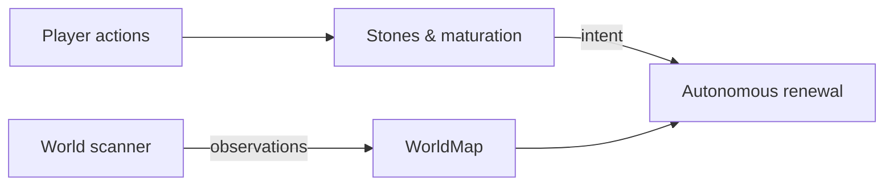
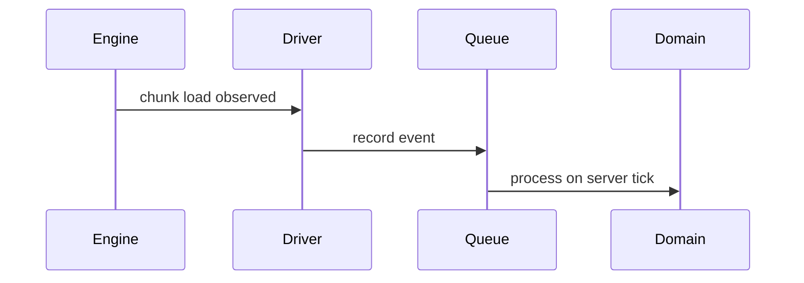
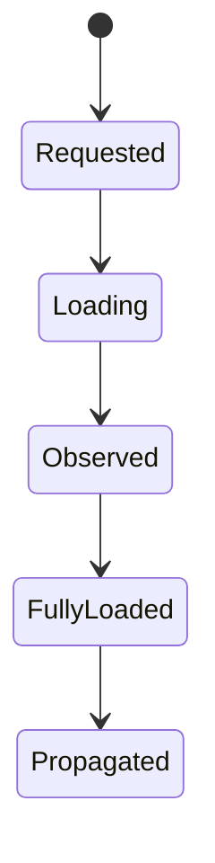
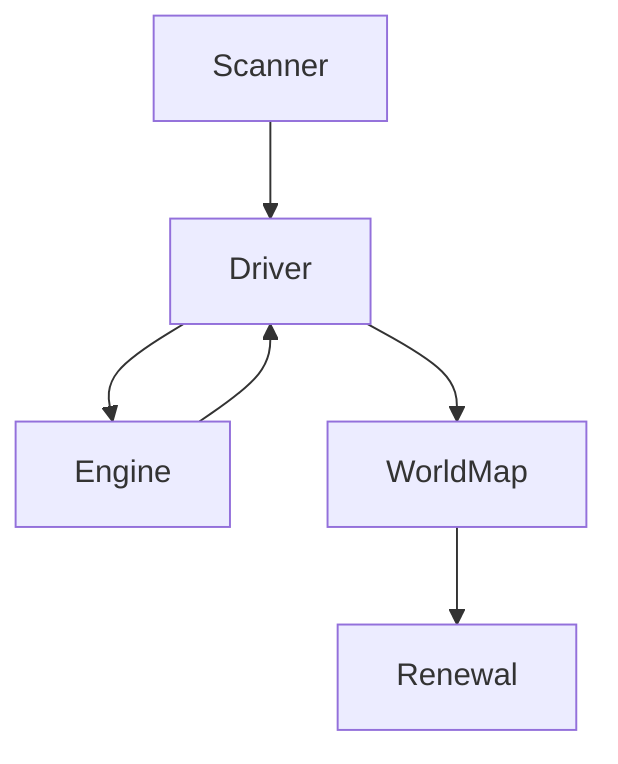

# Memento — Architecture

This document is **institutional memory** for Memento’s architecture.

It records architectural intent, responsibility boundaries, and hard‑won decisions so that future maintainers do not have to rediscover them through failure. The focus is on **what must remain true**, not on explaining the code line‑by‑line.

This document is not user‑facing. Gameplay concepts, player experience, and operator semantics are covered in [README.md](README.md) and [RENEWAL_MODEL.md](RENEWAL_MODEL.md). Development setup and workflows are covered in [DEVELOPMENT.md](DEVELOPMENT.md). Where those documents already define concepts, this document references them instead of repeating them.

Architectural decisions are referenced by **ADR number**. ADRs are part of the contract: they explain *why* the architecture looks the way it does.

---

## 1. Mental model: two interacting mechanisms

Memento is built around **two distinct but interacting mechanisms**:

1. **Player‑driven, time‑based in‑game mechanics**
2. **Autonomous, conservative world renewal**

These mechanisms serve different purposes and have different guarantees, but they operate on the same physical substrate: **Minecraft chunks**.

The player‑driven side exists to express *intent*. Stones allow players and operators to guide renewal or explicitly protect land. These mechanics are visible, explainable, and grounded in gameplay.

The autonomous side exists to preserve long‑term world health. It observes the world gradually, tolerates incomplete information, and acts conservatively. Its goal is not speed or completeness, but **eventual, safe progress**.

Neither mechanism fully controls the other. Player intent influences autonomous renewal, but does not force it. Autonomous renewal remains cautious even in the presence of explicit guidance. This separation is foundational and is reinforced throughout the architecture (ADR‑001).

The **scanner** exists to bridge these mechanisms. It observes the world over time and builds durable knowledge that enables renewal decisions and later forgettability computation. Observation is explicitly decoupled from execution.

---

## 2. Player‑driven mechanics (in‑game layer)

The player‑driven layer is responsible for **expressing intent**, not for executing change.

Stones are designed to be understandable in‑world artifacts. They mature over time, produce visible effects, and can be inspected by operators. Their role is to say *what should eventually happen*, not *when or how it happens*.

### Witherstone — intent to renew

A Witherstone expresses explicit intent that an area may renew. It matures over time and, once mature, produces exactly one `RenewalBatch`. That batch has a clear lifecycle and ownership and is never reused (ADR‑005).

The Witherstone itself does not load chunks, does not trigger regeneration, and does not bypass engine constraints. It merely establishes eligibility.

### Lorestone — intent to protect

A Lorestone expresses protection. It marks land as non‑renewable regardless of natural forgettability or Witherstone influence.

Lorestones have no automatic lifecycle and are never consumed implicitly. Their purpose is to give operators a durable, conservative override without weakening the autonomous model.

Player‑driven mechanics deliberately **do not**:

* scan chunks
* load chunks
* schedule renewal

Those responsibilities belong to the autonomous layer.

---

## 3. Autonomous, conservative renewal (system layer)

Autonomous renewal is designed to operate safely in long‑running servers with incomplete information and unpredictable player behavior.

It prefers inaction over action. It tolerates missing data. It avoids holding unnecessary runtime state. These properties are not optimizations; they are safeguards derived from repeated failure modes.

### Detection versus execution

Memento strictly separates **detection** from **execution** (ADR‑002).

Detection answers questions such as:

* Which chunks are known?
* Which chunks are eligible for renewal?

Execution answers a different question:

* When does the world allow change without disruption?

Detection does not depend on chunk load state. Execution is deferred until chunks unload and reload naturally. Renewal never forces chunk unloads or reloads.

### Server authority

Minecraft remains authoritative over chunk lifecycle, scheduling, and world generation (ADR‑003).

Memento does not implement its own world generation and does not override engine lifecycle rules. All renewal is opportunistic and engine‑mediated.

---

## 4. Shared core: chunks, observation, and state

Both mechanisms operate on chunks, but **chunk loading is a shared, scarce resource** in a modded ecosystem.

Other mods may load chunks for their own purposes. Memento must coexist with them rather than compete. For this reason, scanning deliberately piggybacks on unsolicited chunk loads and avoids aggressive scheduling (ADR‑009).

### Events as the domain boundary

All interaction between the Minecraft engine and Memento’s domain logic happens through **typed domain events** (ADR‑006).

Engine callbacks are treated as *facts*. They are recorded and processed later on controlled execution paths. No semantic decisions are made inside engine threads.

This decoupling prevents concurrency bugs and makes progress observable and explainable.

---

## 5. Core components and responsibilities

### StoneTopology

`StoneTopology` is the sole authority on how stone influences combine. All renewal eligibility resolution flows through it (ADR‑004).

If this component is wrong or bypassed, the system loses semantic consistency. For that reason, no other component may infer stone influence independently.

### WorldMap

`WorldMap` is Memento’s **institutional memory**. It records what the system has observed about the world.

It is monotonic in meaning: once a chunk is known or observed, that knowledge is not forgotten. Missing or partial metadata is a valid state, not an error.

There is no separate scan plan. **The map is the plan** (ADR‑009).

### World scanner

The scanner owns **demand and reconciliation**. It decides what should be observed next based on the current state of the WorldMap.

Scanning is reactive. It observes what the engine makes available and converges without retries (ADR‑015). A chunk is considered scanned once observation has occurred, regardless of metadata completeness (ADR‑013).

Completion switches the scanner into a passive mode. Observation continues, but no new demand is generated.

### Chunk Load Driver

The Chunk Load Driver encapsulates all interaction with the Minecraft engine’s chunk lifecycle (ADR‑008).

It executes load requests, observes engine signals, and forwards observations when chunks are safely accessible. It does not decide *what* to load.

There is no internal scheduler. Load pacing relies on Minecraft’s own scheduling and on observed latency (ADR‑010).

### Visualization

Visualization is server‑side, vanilla, and observational only (ADR‑018, ADR‑019).

Visual effects explain what the system is doing, but they never influence decisions or control flow.

---

## 6. Illustrative flows

The important aspect is directionality: intent flows downward, observations flow upward, and no component shortcuts these paths.

---

## 7. Architectural invariants (locks)

The following properties must remain true:

* Minecraft owns chunk lifecycle authority
* No forced chunk unloads
* Detection is separated from execution
* Scanner owns demand; driver owns execution
* No central orchestrator
* No internal load scheduler
* Piggyback unsolicited loads
* WorldMap is authoritative memory
* Partial knowledge is valid
* Observability must explain stalling and progress

Violating these invariants requires an explicit architectural decision.

---

## 8. Notes on extensions

The scanner and WorldMap form the foundation for later forgettability computation and analysis. Algorithmic details are intentionally excluded from this document.

---

## 9. Architectural Decision Records (ADRs)

### ADR‑001: Two renewal mechanisms coexist

Two renewal mechanisms exist: player‑driven stones and autonomous renewal. Separating them stabilizes semantics and preserves player agency.
→ Collapsing them caused renewal to become reactive and brittle.

### ADR‑002: Detection vs execution

Detection observes eligibility; execution applies change when the world allows it.
→ Coupling them caused cascading side effects and irrecoverable partial progress.

### ADR‑003: Server authority over chunk lifecycle

Minecraft owns chunk lifecycle and scheduling.
→ Overriding this caused instability and engine conflicts.

### ADR‑004: StoneTopology is sole influence authority

All stone influence resolution flows through StoneTopology.
→ Duplicate logic drifted and produced conflicting outcomes.

### ADR‑005: One Witherstone → one RenewalBatch

Each Witherstone produces exactly one RenewalBatch.
→ Reuse or multiplexing destroyed lifecycle clarity.

### ADR‑006: Typed domain events as boundary

Engine interaction is mediated through typed events.
→ Direct callbacks leaked threading assumptions into the domain.

### ADR‑007: Engine‑mediated scanning

Scanning reacts to engine availability.
→ Aggressive scheduling caused load storms.

### ADR‑008: Shared Chunk Load Driver

All engine interaction is encapsulated in the driver.
→ Bypassing it reintroduced concurrency bugs.

### ADR‑009: WorldMap replaces scan plans

The map itself is the plan.
→ Separate plans drifted from reality.

### ADR‑010: Adaptive pacing over fixed modes

Pacing is based on observed latency.
→ Static modes failed under real load.
