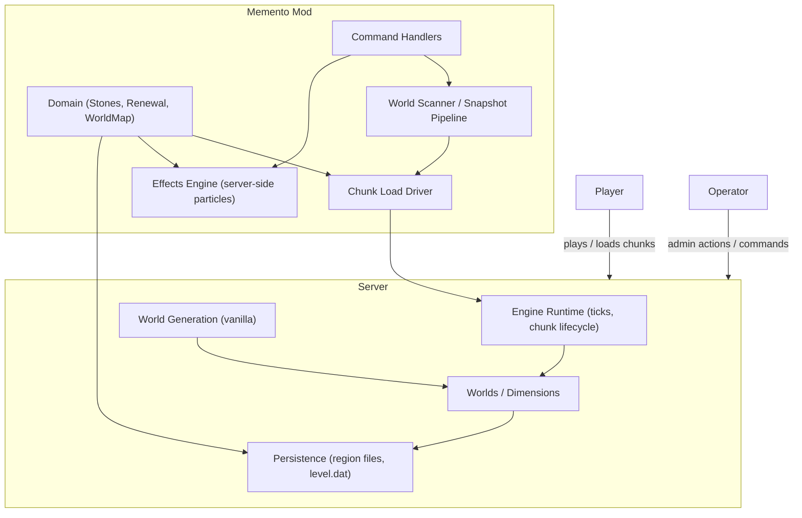
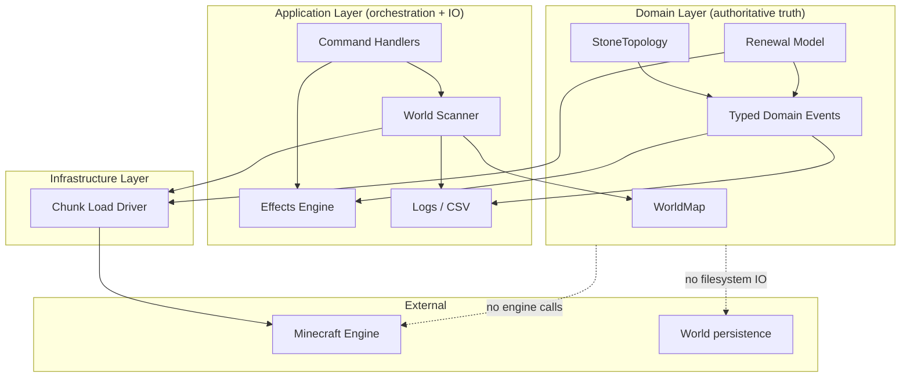
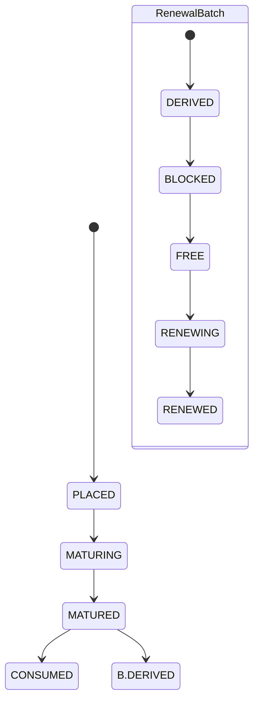

# Memento — Architecture (Draft)

This document is **institutional memory** for Memento’s architecture. It records the boundaries, invariants, and lifecycle decisions that must remain stable so we don’t re-litigate rejected approaches or erode semantics during iteration.

It is not user-facing documentation. It prioritizes **durable decisions** over implementation detail.

---

## Context map

**Lock:** Minecraft owns *world generation* and *chunk lifecycle authority*.  
Memento guides renewal and produces effects and snapshots; it does not implement its own worldgen.

---

## Structural map and dependency direction

**Lock:**  
Only the **Chunk Load Driver** interacts directly with the Minecraft engine’s chunk lifecycle events.

---

## Renewal paths

Memento supports **two renewal paths**:

1. **Automatic renewal**  
   Gradual renewal of rarely visited regions (outskirts). This is the primary objective.

2. **Player / operator-controlled renewal**  
   Explicit placement of stones to guide renewal or protection.

**Lock:** Complexity is stabilized through the stone-driven path first.

---

## Core world interaction model

### Detection vs execution

Memento strictly separates:

- **Detection** of what *should* be renewed
- **Execution** of renewal *when the world allows it*

Detection is independent of chunk load state. Execution is deferred.

### Deferred execution

Renewal does **not** force chunk unloads or immediate reloads.  
Progress depends on naturally observed server events.

**Lock:** Renewal is eventually consistent and non-deterministic by design.

---

## Chunk loading and pacing

### Chunk Load Driver

The Chunk Load Driver is the **sole mediator** between Memento and engine chunk lifecycle signals.

Responsibilities:

- Issue and manage chunk load tickets
- Observe engine load/unload signals (signal-only)
- Defer forwarding until chunks are safely accessible
- Re-arm tickets if access is delayed
- Apply adaptive pacing based on observed load latency
- Emit clear, structured logs for observability

**Lock:** No other class may subscribe to engine chunk load or unload events.

### Adaptive pacing

The driver measures the latency between:

- ticket issuance  
- and chunk accessibility

A smoothed moving average is used to determine when to issue the next ticket.

**Lock:** Pacing is based on observed behavior, not static yield or passive modes.

---

## World inspection and scanning

### WorldMap as plan

The **WorldMap** is the authoritative structure describing all known chunks.

- Built from region discovery
- Gradually enriched with metadata
- Serves as both *inspection state* and *renewal input*

There is no separate scan plan or discovery phase.

**Lock:** The map *is* the plan.

### Scanner behavior

The scanner:

- Iterates over the WorldMap
- Requests chunks whose metadata is missing
- Extracts metadata when chunks become accessible
- Explicitly marks chunks as scanned when metadata is stored
- Terminates when all chunks have metadata and the snapshot is written

Progress is explicit and observable.

**Lock:** There must be a single, obvious point where a chunk becomes “scanned”.

---

## Stones

### Witherstone

Witherstone expresses **intent to renew** an area.

- Matures over time
- Produces exactly one RenewalBatch
- Is consumed once renewal completes

### Lorestone

Lorestone expresses **protection**.

- Has no automated lifecycle
- Is never consumed automatically
- Overrides renewal influence

---

## Lifecycles and intersection

Witherstone and RenewalBatch lifecycles are distinct but linked.

**Locks:**

- One Witherstone produces exactly one RenewalBatch
- RenewalBatch progression is event-driven

---

## Domain events as boundary

The domain emits **typed events** describing facts and transitions.

Application and infrastructure react to these events for:

- visualization
- scheduling
- logging
- snapshot output

**Lock:** Domain events separate semantic decisions from execution.

---

## Architectural invariants

1. Chunk lifecycle authority remains with the server
2. No forced chunk unloads
3. Renewal is deferred and event-driven
4. WorldMap is the plan
5. Renewal works without inspection
6. One driver owns engine interaction
7. Domain remains pure
8. Observability must explain stalling and progress

---

## ADR index (append-only)

- ADR-001: Two renewal paths; stone-driven path stabilizes mechanics
- ADR-002: Detection vs execution; deferred renewal
- ADR-003: Server authority over chunk lifecycle
- ADR-004: StoneTopology is sole influence authority
- ADR-005: One Witherstone → one RenewalBatch
- ADR-006: Typed domain events as boundary
- ADR-007: Engine-mediated scanning
- ADR-008: Chunk Load Driver encapsulates engine interaction
- ADR-009: WorldMap replaces scan plans
- ADR-010: Adaptive pacing replaces yield/passive modes
