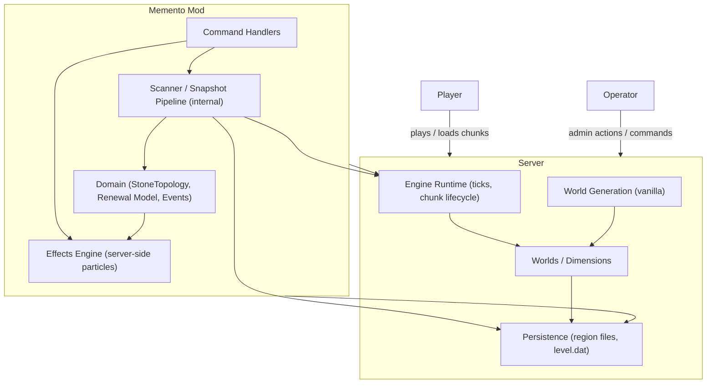
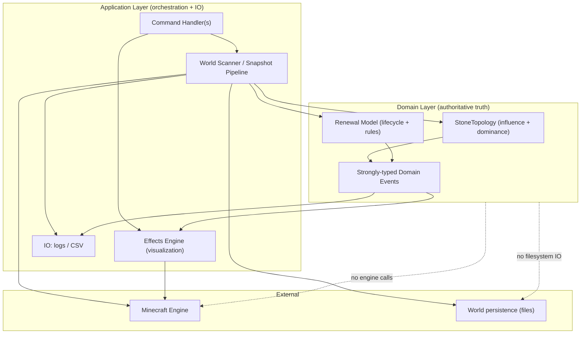
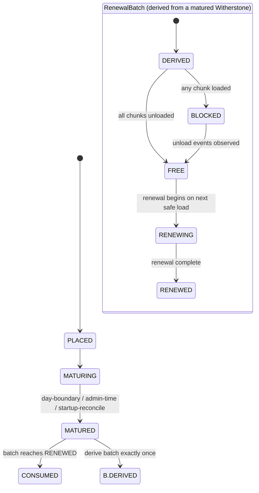

# Memento — Architecture (Draft)

This document is **institutional memory** for Memento’s architecture. It records the boundaries, invariants, and lifecycle decisions that must remain stable so we don’t re-litigate rejected approaches or erode semantics during iteration.

It is not user-facing documentation. It prioritizes **durable decisions** over implementation detail.

---

## Context map

**Lock:** Minecraft owns *world generation* and *chunk lifecycle authority*. Memento guides renewal and produces effects and snapshots; it does not implement its own worldgen.

---

## Structural map and dependency direction

**Lock:** Domain does not orchestrate, tick, load chunks, write files, or call the engine. Application does orchestration and IO and may query the domain.

---

## Renewal paths

Memento supports **two renewal paths**:

1. **Automatic renewal**  
   Gradual renewal of rarely visited regions (outskirts). This is the primary objective.

2. **Player / operator-controlled renewal**  
   Explicit placement of stones to guide renewal or protection. This is a secondary objective used to validate and stabilize mechanics.

**Lock:** We intentionally stabilize complexity via the stone-driven path first, even though it is not the primary objective.

---

## Core world interaction model

### Detection vs execution

Memento strictly separates:

- **Detection** of what *should* be renewed
- **Execution** of renewal *when the world allows it*

Detection is independent of chunk load state. Renewal execution is deferred until the server naturally unloads and reloads chunks.

### Deferred execution

For renewal, Memento does **not** force chunk unloads or loads. It observes server events and progresses when conditions are met.

This yields:

- non-deterministic timing
- incremental progress
- eventual consistency (not immediate effect)

**Lock:** This behavior is fundamental; attempts to “make renewal immediate” have unacceptable stability risk.

---

## Stones

### Witherstone

Witherstone expresses **intent to renew** an area.

- matures over time
- derives exactly one renewal operation
- is consumed once renewal completes

**Lock:** Witherstone initiates renewal; it does not perform renewal.

### Lorestone

Lorestone expresses **protection**.

- no automated lifecycle
- does not mature
- is never consumed automatically
- protects an area within a defined radius

**Lock:** Witherstone influence is overridden by protection. Lorestone exists to exclude regions from renewal logic.

---

## Lifecycles and intersection

Memento has two distinct lifecycles. They are linked, but independent.

### Witherstone lifecycle

States:

- `PLACED`
- `MATURING`
- `MATURED`
- `CONSUMED`

Triggers for maturity:

- nightly checkpoint (day boundary)
- administrative time adjustment
- server startup when persisted state indicates maturity

Once a Witherstone reaches `MATURED`, it produces exactly one RenewalBatch.

### RenewalBatch lifecycle

A RenewalBatch represents a group of chunks derived from a matured Witherstone.

States:

- `DERIVED`
- `BLOCKED` (some chunks still loaded)
- `FREE` (all chunks unloaded)
- `RENEWING`
- `RENEWED`

Progression depends on observed server events.

### Intersection overview

**Locks:**
- One Witherstone produces exactly one RenewalBatch.
- RenewalBatch progression is event-driven; the server remains authority over chunk load/unload.

---

## Operator control and system settling

Renewal depends on chunk unloads. Operators can influence progress (but must not force it through unsafe means):

1. **Leave the area** — sufficient for outskirts.
2. **Log players out** — reduces active tickets near inhabited regions.
3. **Restart the server** — clears residual tickets and ensures unload.

**Lock:** These are escape hatches that preserve the invariants; they are not required for normal operation.

---

## Stone influence authority

### StoneTopology

StoneTopology is the **single source of truth** for stone influence and dominance.

**Lock:** All influence/dominance data used by scanning, effects, and renewal must come from StoneTopology. No parallel “projector” or duplicate influence logic is permitted.

---

## Domain events as the decision/execution boundary

We separate “deciding” from “doing”:

- Domain emits **strongly typed events** describing facts and transitions.
- Application reacts: visualization, logging, scheduling, snapshot output.

**Lock:** Domain events are a stability mechanism. They prevent domain semantics from leaking into orchestration and effect code.

---

## World inspection and snapshotting

World inspection exists for development and validation. It is an operator-triggered, long-running activity that produces an inspectable snapshot (e.g., CSV). It must remain separate from renewal execution.

### Engine-mediated scanning (current approach)

Scanning currently uses the Minecraft engine as interpreter instead of re-implementing region/NBT decoding. This avoids duplicating complex, version-sensitive behavior already implemented by the engine.

**Consequence:** scanning may be resource-intensive and must be **throttled** and **observable**.

### Renewal vs inspection (critical split)

**Invariant:** Renewal must not force chunk loads or unloads.

Inspection may perform controlled engine interactions (including temporary chunk loads) for analysis, but:

- must be paced
- must be bounded
- must not perform renewal actions
- must not change renewal eligibility or lifecycle state

This split must remain explicit to avoid accidental coupling.

---

## Architectural invariants

1. **No forced unloads** — Memento must never forcibly unload chunks.
2. **Deferred renewal** — renewal executes only in response to naturally observed unload/load events.
3. **One renewal per Witherstone** — each Witherstone produces exactly one RenewalBatch.
4. **Server authority** — the Minecraft server remains sole authority over chunk lifecycle decisions.
5. **StoneTopology authority** — no duplicate influence logic.
6. **Domain purity** — domain does not call engine/filesystem or orchestrate work.
7. **Inspection ≠ renewal** — snapshotting/analysis must not execute renewal.

---

## Persistence and continuity

All lifecycles are persisted so that:

- restarts do not reset progress
- matured Witherstones are reconciled on startup
- RenewalBatches resume consistently

**Lock:** Persistence mechanism must not leak into domain APIs. Domain defines meaning; application/infrastructure defines storage.

---

## Lightweight ADR index (append-only)

- ADR-001: Two renewal paths; stone-driven path used to stabilize mechanics early.
- ADR-002: Detection vs execution; deferred renewal; eventual consistency.
- ADR-003: Renewal never forces chunk loads/unloads; server remains authority.
- ADR-004: StoneTopology is sole authority for influence/dominance; remove projectors.
- ADR-005: Witherstone and RenewalBatch lifecycles are independent but linked.
- ADR-006: Typed domain events separate decisions from effects.
- ADR-007: Engine-mediated scanning chosen initially to avoid re-implementing engine semantics; scanning is throttled and observable.
