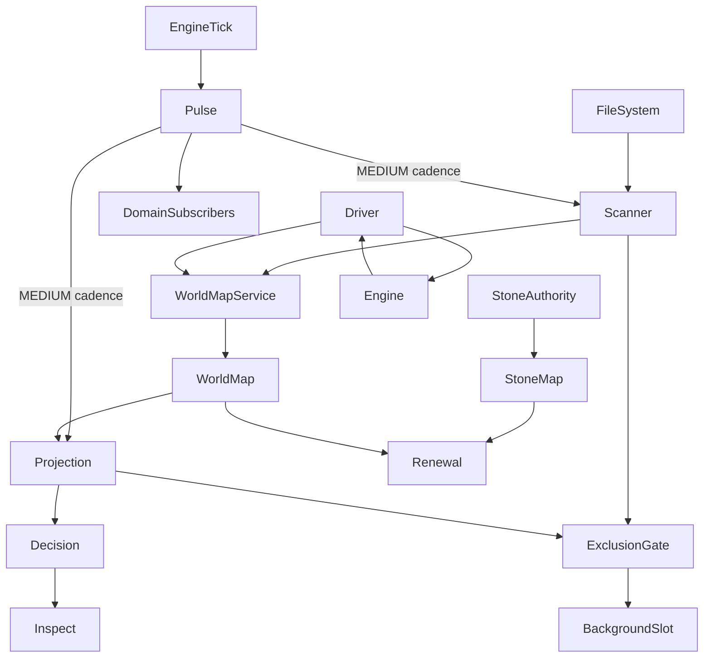

# Memento — Architecture

This document is **institutional memory** for Memento’s architecture.

It records architectural intent, responsibility boundaries, and hard‑won decisions so that future maintainers do not have to rediscover them through failure. The focus is on **what must remain true**, not on explaining the code line‑by‑line.

This document is not user‑facing. Gameplay concepts, player experience, and operator semantics are covered in [README.md](README.md) and [RENEWAL_MODEL.md](RENEWAL_MODEL.md). Development setup and workflows are covered in [DEVELOPMENT.md](DEVELOPMENT.md). Where those documents already define concepts, this document references them instead of repeating them.

Architectural decisions are referenced by **ADR number**. ADRs are part of the contract: they explain *why* the architecture looks the way it does.

---

## 1. Mental model: two interacting mechanisms

Memento is built around **two distinct but interacting mechanisms**:

1. **Player‑driven, time‑based in‑game mechanics**
2. **Autonomous, conservative world renewal**

These mechanisms serve different purposes and have different guarantees, but they operate on the same physical substrate: **Minecraft chunks**.

The player‑driven side exists to express *intent*. Stones allow players and operators to guide renewal or explicitly protect land. These mechanics are visible, explainable, and grounded in gameplay.

The autonomous side exists to preserve long‑term world health. It observes the world gradually, tolerates incomplete information, and acts conservatively. Its goal is not speed or completeness, but **eventual, safe progress**.

Neither mechanism fully controls the other. Player intent influences autonomous renewal, but does not force it. Autonomous renewal remains cautious even in the presence of explicit guidance. This separation is foundational and is reinforced throughout the architecture (ADR‑001).

The **scanner** exists to bridge these mechanisms. It observes the world over time and builds durable knowledge that enables renewal decisions and later forgettability computation. Observation is explicitly decoupled from execution.

---

## 2. Player‑driven mechanics (in‑game layer)

The player‑driven layer is responsible for **expressing intent**, not for executing change.

Stones are designed to be understandable in‑world artifacts. They mature over time, produce visible effects, and can be inspected by operators. Their role is to say *what should eventually happen*, not *when or how it happens*.

### Witherstone — intent to renew

A Witherstone expresses explicit intent that an area may renew. It matures over time and, once mature, produces exactly one `RenewalBatch`. That batch has a clear lifecycle and ownership and is never reused (ADR‑005).

The Witherstone itself does not load chunks, does not trigger regeneration, and does not bypass engine constraints. It merely establishes eligibility.

### Lorestone — intent to protect

A Lorestone expresses protection. It marks land as non‑renewable regardless of natural forgettability or Witherstone influence.

Lorestones have no automatic lifecycle and are never consumed implicitly. Their purpose is to give operators a durable, conservative override without weakening the autonomous model.

Player‑driven mechanics deliberately **do not**:

* scan chunks
* load chunks
* schedule renewal

Those responsibilities belong to the autonomous layer.

---

## 3. Autonomous, conservative renewal (system layer)

Autonomous renewal is designed to operate safely in long‑running servers with incomplete information and unpredictable player behavior.

It prefers inaction over action. It tolerates missing data. It avoids holding unnecessary runtime state. These properties are not optimizations; they are safeguards derived from repeated failure modes.

### Detection versus execution

Memento strictly separates **detection** from **execution** (ADR‑002).

Detection answers questions such as:

* Which chunks are known?
* Which chunks are eligible for renewal?

Execution answers a different question:

* When does the world allow change without disruption?

Detection does not depend on chunk load state. Execution is deferred until chunks unload and reload naturally. Renewal never forces chunk unloads or reloads.

### Server authority

Minecraft remains authoritative over chunk lifecycle, scheduling, and world generation (ADR‑003).

Memento does not implement its own world generation and does not override engine lifecycle rules. All renewal is opportunistic and engine‑mediated.

---

## 4. Shared core: chunks, observation, and state

Both mechanisms operate on chunks, but **chunk loading is a shared, scarce resource** in a modded ecosystem.

Other mods may load chunks for their own purposes. Memento must coexist with them rather than compete. For this reason, scanning deliberately piggybacks on unsolicited chunk loads and avoids aggressive scheduling (ADR‑009).

### Events as the domain boundary

All interaction between runtime boundaries and domain logic happens through **typed domain events and typed metadata facts** (ADR‑006, ADR‑013).

Boundary doctrine is explicit:

* Engine callbacks are treated as boundary signals, not as direct mutation points.
* Scanner and Driver publish metadata facts into domain-owned ingestion.
* Stone lifecycle transitions are emitted as typed domain events.
* Renewal-side recomputation is event-driven and consumes dominance from `StoneMapService`.

No semantic decisions are made inside engine threads.

This decoupling prevents concurrency bugs and makes progress observable and explainable.

---

## 5. Core components and responsibilities

### Stone authority (`StoneAuthority`)

Stone authority owns stone register lifecycle semantics:

* placement and removal
* maturity progression and lifecycle transitions
* persistence of stone definitions

It does not own factual world memory and does not own scanner orchestration.

### Stone map (`StoneMapService`)

`StoneMapService` is the sole influence-projection authority for dominant stone resolution at chunk granularity (ADR‑014).

It projects from stone authority state and provides read surfaces for consumers such as renewal and world-map overlays. No other component may infer dominance independently.

### Renewal engine

Renewal consumes world facts from `WorldMapService` and stone influence from `StoneMapService`.

Renewal eligibility derivation is owned on the renewal side and must use `StoneMapService` for dominant-stone lookup rather than re-deriving stone influence internally.

### Renewal projection (`RenewalProjection`)

`RenewalProjection` is a **derived, ephemeral evaluation boundary** (ADR‑017, ADR‑018).

It owns:

* recomputation state (`COMPUTING`, `STABILIZING`, `STABLE`)
* generation-scoped snapshot evaluation
* materialized renewal decision for read-only surfaces

`RenewalProjection` is fully recomputable from `WorldMap` facts and must not persist derived projection metrics into factual world memory.

### WorldMap

`WorldMap` is Memento’s **institutional memory**. It records what the system has observed about the world.

It is monotonic in meaning: once a chunk is known or observed, that knowledge is not forgotten. Missing or partial metadata is a valid state, not an error.

There is no separate scan plan. **The map is the plan** (ADR‑009).

### WorldMapService

`WorldMapService` is the **domain lifecycle and mutation authority** for `WorldMap`.

It owns:

* startup and shutdown lifecycle of the authoritative map instance
* ingestion of metadata facts from infrastructure publishers
* tick-thread application of metadata facts into `WorldMap`

No infrastructure component mutates `WorldMap` directly.

### World scanner

The scanner is an infrastructure component that owns **filesystem discovery reconciliation and completion** for `/memento scan`.

Active scan is file-primary and two-pass. Chunk metadata is read from region/NBT files off-thread and emitted as metadata facts into `WorldMapService` for tick-thread application. The scanner does not emit proactive engine demand.

A chunk is considered scanned once file observation has occurred, regardless of metadata completeness. Chunks unresolved after the two-pass file scan remain recorded as unresolved in the WorldMap and completion aggregates; active scan still completes.

After completion, scanner behavior is passive/reactive only: unsolicited engine observations can still enrich map metadata over time through metadata-fact ingestion, but no active demand path is opened.

### Chunk Load Driver

The Chunk Load Driver encapsulates all interaction with the Minecraft engine’s chunk lifecycle (ADR‑008).

It executes renewal load requests, observes engine signals including ambient load activity, and emits metadata facts when chunks are safely accessible. It does not decide *what* to load.

There is no internal scheduler. Load pacing relies on Minecraft’s own scheduling and on observed latency (ADR‑010).

For scanning doctrine, the driver has no scanner-demand responsibility. It serves renewal demand and ambient observation pathways, and it does not emit map facts for expiry outcomes that never reached full-load accessibility.

### Pulse generator

Pulse generation is an infrastructure concern that shields domain logic from raw server tick handling.

The pulse generator emits cadence signals only. It does not call domain components with semantic intent and it does not decide what business logic should run.

Cadence tiers are centralized in `MementoConstants` and currently defined as:

* HIGH = every 1 tick
* MEDIUM = every 10 ticks
* LOW = every 100 ticks
* ULTRA_LOW = every 1000 ticks
* EXTREME_LOW = every 10000 ticks

Cadence delivery doctrine:

* Domain and application components subscribe to cadence signals and own their own logic.
* Startup wiring may register subscriptions, but must not encode semantic execution policy inside the pulse generator.
* Non-HIGH cadences are phase-staggered so they do not co-fire on the same server tick.
* Busy-retry policy for deferred background work is caller-owned and currently mediated on `MEDIUM` cadence; cadence transport itself remains non-semantic.

### Global async exclusion gate

`GlobalAsyncExclusionGate` is an infrastructure-only concurrency boundary for deferred background work (ADR‑019).

It provides:

* one global background execution slot
* reject-while-busy submission behavior
* explicit attach/detach lifecycle

It does **not** provide:

* queueing
* fairness or prioritization
* semantic retry policy

Retry ownership remains with caller components (scanner/projection/future renewal execution), preserving detection/execution boundaries and avoiding hidden orchestration.

### Visualization

Visualization is server‑side, vanilla, and observational only (ADR‑018, ADR‑019).

Visual effects explain what the system is doing, but they never influence decisions or control flow.

---

## 6. Illustrative flows

The important aspect is directionality: intent flows downward, observations flow upward, and no component shortcuts these paths.

---

## 7. Architectural invariants (locks)

The following properties must remain true:

* Minecraft owns chunk lifecycle authority
* No forced chunk unloads
* Detection is separated from execution
* Scanner owns filesystem scan orchestration and reconciliation for active runs
* Driver owns engine execution for renewal demand and ambient load observation handling
* Scanner does not generate proactive engine demand
* No central orchestrator
* Pulse generator is cadence transport only, never semantic orchestration
* No internal load scheduler
* RenewalProjection is a formal derived boundary: ephemeral, recomputable, and generation-guarded on apply
* Derived renewal metrics/decisions must not be persisted into WorldMap factual memory
* Global async exclusion gate is infra-only: one background slot, reject-while-busy, no queue/fairness/prioritization semantics
* Busy retry ownership is caller-side and cadence-driven (current policy: MEDIUM cadence), not gate-owned
* Cadence constants are centralized in `MementoConstants` with no in-code magic cadence numbers
* Non-HIGH cadence tiers are phase-staggered and must not co-fire on the same server tick
* Piggyback unsolicited loads
* WorldMap is authoritative memory
* WorldMapService is the sole world map lifecycle and mutation authority
* All domain interactions and mutations must execute on the server tick thread
* Cooperative time-slicing is mandatory for tick-thread domain work: bounded per-tick processing, no monopolizing loops
* Stone authority owns stone placement lifecycle and persistence
* Stone bootstrap uses one authoritative entry pathway: persisted stones must enter lifecycle through the same StoneAuthority mutation-transition semantics as runtime additions, never through a separate silent startup insertion path
* Startup order is explicit and observable in server initialization: runtime subscribers/consumers must be wired before persisted-stone processing begins
* Persisted-stone processing must be a distinct, identifiable bootstrap step in `Memento` lifecycle wiring and must not be hidden inside mixed wiring helpers
* StoneMapService is the sole dominant-stone projection authority
* Renewal and overlays consume StoneMapService for dominance lookup
* Scanner and Driver publish boundary-safe metadata facts, not chunk runtime objects
* Driver emits world map metadata facts only when full-load accessibility is reached
* Expiry outcomes without full-load accessibility do not mutate WorldMap
* Partial knowledge is valid
* Active scan may complete with unresolved leftovers recorded explicitly
* Observability must explain stalling and progress
* Inspect/operator-facing scheduler status remains human-facing; internal state fields remain diagnostic-level, not operator-copy contracts

Violating these invariants requires an explicit architectural decision.

---

## 8. Notes on extensions

The scanner and WorldMap form the foundation for later forgettability computation and analysis. Algorithmic details are intentionally excluded from this document.

---

## 9. Architectural Decision Records (ADRs)

### ADR-001: Two renewal mechanisms coexist

Two renewal mechanisms exist: player-driven stones and autonomous renewal. Separating them stabilizes semantics and preserves player agency.  
→ Collapsing them caused renewal to become reactive and brittle.

---

### ADR-002: Detection vs execution

Detection observes eligibility; execution applies change when the world allows it.  
→ Coupling them caused cascading side effects and irrecoverable partial progress.

---

### ADR-003: Server authority over chunk lifecycle

Minecraft owns chunk lifecycle and scheduling.  
→ Overriding this caused instability and engine conflicts.

---

### ADR-004: StoneTopology is sole influence authority (superseded by ADR-014)

All stone influence resolution flows through StoneTopology.  
→ Duplicate logic drifted and produced conflicting outcomes.

---

### ADR-005: One Witherstone → one RenewalBatch

Each Witherstone produces exactly one RenewalBatch.  
→ Reuse or multiplexing destroyed lifecycle clarity.

---

### ADR-006: Typed domain events as boundary

Engine interaction is mediated through typed events.  
→ Direct callbacks leaked threading assumptions into the domain.

---

### ADR-007: Engine-mediated scanning (superseded by ADR-012)

Scanning reacts to engine availability.  
→ Aggressive scheduling caused load storms.

---

### ADR-008: Shared Chunk Load Driver

All engine interaction is encapsulated in the driver.  
→ Bypassing it reintroduced concurrency bugs.

---

### ADR-009: WorldMap replaces scan plans

The map itself is the plan.  
→ Separate plans drifted from reality.

---

### ADR-010: Adaptive pacing over fixed modes

Pacing is based on observed latency.  
→ Static modes failed under real load.

---

### ADR-011: Scan completion allows unresolved file leftovers

Active scan completion is defined by completion of file-primary two-pass processing and queue drain, not by full metadata success for every chunk. Unresolved leftovers remain first-class WorldMap state and completion telemetry.  
→ Treating unresolved leftovers as non-terminal blocked scan closure despite explicit best-effort semantics.

---

### ADR-012: Filesystem-primary scanning with no scanner demand

Active scanning is driven by filesystem region/NBT reads, not by scanner-issued engine demand. The engine remains a passive observation source only for unsolicited loads.  
→ Scanner demand paths coupled detection to engine pressure and increased orchestration complexity.

---

### ADR-013: Domain WorldMapService and metadata-fact ingestion boundary

World map lifecycle and mutation authority are centralized in domain `WorldMapService`. Scanner and Driver are infrastructure publishers that emit boundary-safe metadata facts; they do not propagate chunk runtime objects across the boundary.

Driver serves renewal demand plus ambient load observation handling, and emits world map facts only when full-load accessibility is reached. Expiry outcomes without full-load accessibility remain lifecycle signals and do not mutate world map state.  
→ Direct scanner-owned map lifecycle and chunk-object propagation blurred authority and thread boundaries, increasing coupling and reducing explainability.

---

### ADR-014: Split stone lifecycle authority and stone influence projection authority (superseded by ADR-015)

Stone lifecycle ownership remains in stone authority (implementation name at decision time: `StoneTopology`) for placement, removal, maturity transitions, and persistence.

Dominant-stone projection at chunk granularity is owned solely by `StoneMapService`.

Renewal-side derivation consumes `StoneMapService` dominance and must not re-derive influence independently.

Class renaming to `StoneAuthority` is deferred until functional parity validation is complete.  
→ This split preserves lifecycle clarity while removing projection duplication risk across renewal and overlays.

---

### ADR-015: Naming alignment — lifecycle authority uses `StoneAuthority`

After parity verification, the lifecycle authority naming was updated from `StoneTopology` to `StoneAuthority` across code references and integration hooks.

This ADR changes naming only. Ownership boundaries, lifecycle behavior, dominance semantics, and renewal derivation rules remain unchanged.

---

### ADR-016: Infrastructure pulse generator and cadence shielding

Server tick handling is shielded through an infrastructure pulse generator that emits cadence signals and does not execute semantic domain decisions.

Domain and application components subscribe to cadence tiers and own their own logic. Startup wiring may bind subscribers but does not transfer semantic authority to the pulse generator.

Cadence tier values are centralized in `MementoConstants` and currently locked to 1, 10, 100, 1000, and 10000 tick intervals. Non-HIGH cadence tiers are phase-staggered and must not co-fire on the same server tick.  
→ Direct per-component raw tick handling and ad-hoc cadence literals caused drift in politeness policy and reduced runtime explainability.

---

### ADR-017: Renewal projection is a derived boundary

Renewal evaluation is isolated into a dedicated projection layer that is fully derived from `WorldMementoMap`.

The projection owns renewal eligibility and decision materialization, but must never persist derived metrics into factual world memory. It is ephemeral and fully recomputable from the world map.  
→ Without a strict derived boundary, renewal metrics would leak into institutional memory. Factual ingestion and interpretative logic would become entangled, weakening the architectural separation between detection and evaluation.

---

### ADR-018: Generation guard for stable renewal decisions

Renewal evaluation operates under a generation model. Each evaluation run derives its result from a specific snapshot of world state. Results are applied only if they match the current generation head.

If newer metadata arrives during computation, earlier generations are discarded.  
→ Without generation guarding, renewal decisions could reflect partially outdated inputs or interleaved evaluation results. Under constant metadata inflow, conclusions would become unstable or ambiguous.

---

### ADR-019: Single background slot for background work

All background work (world scanning, renewal projection evaluation, and future renewal execution) shares a single global execution slot.

Only one background task may run at a time. Concurrent submissions are rejected while the slot is busy. Retry responsibility remains with the caller.  
→ Without serialized background execution, scanning and renewal processing could overlap, compete for resources, or introduce race conditions when renewal begins mutating world data.
