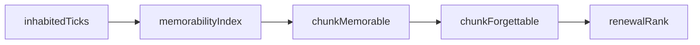

# Memorability and Renewal Pipeline

## Purpose

This document explains how Memento turns player activity into renewal decisions.

It is grounded in the actual pipeline implemented in code:

inhabitedTicks → memorabilityIndex → chunkMemorable → chunkForgettable → renewalRank

Each step is deterministic, local, and bounded. The goal is to make the behavior understandable, explain why it works this way, and provide a stable foundation for future tuning.

---

## 1. The Core Problem

We want the world to “remember” meaningful places and gradually forget the rest.

The challenge is that not all activity is equal:

- Walking through an area leaves traces, but should not protect it
- Building, mining, or returning repeatedly should create lasting memory

So the system must distinguish between:

- **incidental presence**
- **meaningful presence**

And it must do so in a way that:

- feels natural to players
- scales to large worlds
- remains predictable

---

## 2. Pipeline Overview



Each step adds structure:

- **inhabitedTicks** → raw observation
- **memorabilityIndex** → interprets activity spatially
- **chunkMemorable** → defines protected areas
- **chunkForgettable** → defines safe-to-renew regions
- **renewalRank** → decides execution order

For implementation clarity, the chunk-level part is treated as two explicit passes:

- **Pass 1**: `inhabitedTicks -> memorabilityIndex`
- **Pass 2**: `memorabilityIndex -> chunkMemorable`

Pass 2 is a decision rule, not smoothing.

---

## 3. From Activity to Signal

The system starts with a simple measurement:

> How long has a player been in this chunk?

This is recorded as `inhabitedTicks`.

On its own, this signal is insufficient. A path through the world can accumulate ticks without representing meaningful activity.

To address this, we transform the signal into a **continuous field**.

---

## 4. Memorability as a Field

Instead of making a binary decision immediately, we compute:

> memorabilityIndex

Each chunk contributes to its surroundings, and nearby contributions accumulate.

A simplified formulation:

```
memorability(x) = Σ base(y)^2 * weight(distance(x, y))
```

Key design choices:

- Absolute thresholds (no normalization)
- Local radius (bounded influence)
- Quadratic weighting (strong activity dominates)

Current locked GA constants for this slice:

- `R1 = 3`
- `T_low = 50`
- `T_mid = 300`
- `T_high = 2000`

Signal constraints:

- `ticks < T_low => base = 0`
- `contribution = base^2 * weight(distance)`
- `distance` uses Chebyshev metric

This produces an important effect:

- Clusters reinforce themselves
- Sparse paths fade away

### Illustration

```
[ placeholder: small_dataset_ticks.png ]
[ placeholder: small_dataset_memorabilityIndex.png ]
```

---

## 5. From Signal to Protection

Once we have a continuous signal, we convert it into a decision.

A chunk becomes memorable when:

```
memorabilityIndex ≥ T_core
```

This defines the core of protected areas.

However, strong areas need space. A base is not a single point — it occupies an area.

So we extend protection slightly:

- Strong signals create a **local safety halo**
- Weak signals do not

Current locked GA constants for this slice:

- `R2 = 1`
- `T_core = 0.75`
- `T_strong = 0.90` with `T_strong > T_core`

Pass 2 decision rule:

```
chunkMemorable(x) =
    memorabilityIndex(x) >= T_core
 OR max(memorabilityIndex(y) within R2) >= T_strong
```

Pass 2 non-goals:

- no smoothing
- no averaging
- no iterative propagation
- no chaining beyond `R2`

This ensures:

- Bases feel safe at their edges
- Exploration does not create accidental protection

### Illustration

```
[ placeholder: small_dataset_chunkMemorable.png ]
```

---

## 6. From Chunks to Regions

Renewal operates on regions, not individual chunks.

We therefore translate chunk-level memory into region-level eligibility.

A region is considered forgettable if:

- it contains no memorable chunks
- none of its neighboring regions contain memorable chunks

This creates a buffer between lived-in areas and renewal.

### Illustration

```
[ placeholder: small_dataset_chunkForgettable.png ]
```

---

## 7. Ranking Renewal Candidates

Once regions are eligible, they are ranked.

This step is intentionally simple:

- deterministic
- stable
- independent of signal strength

All complexity has already been resolved earlier in the pipeline.

### Illustration

```
[ placeholder: small_dataset_renewalRank.png ]
```

---

## 8. Behavior in Large Worlds

The system does not adapt to the world size.

All calculations are:

- local
- absolute
- bounded

This ensures:

> A new area behaves the same, regardless of how large or active the world is.

### Illustration

```
[ placeholder: large_dataset_memorabilityIndex.png ]
[ placeholder: large_dataset_chunkMemorable.png ]
[ placeholder: large_dataset_renewalRank.png ]
```

---

## 9. Invalidation and Stability

The system updates incrementally.

When new data arrives, only a bounded area is affected:

```
affected radius = R1 + R2
```

For this locked slice: `R1 + R2 = 4` chunks.

This guarantees:

- predictable recomputation cost
- convergence
- no cascading updates

---

## 10. Performance Characteristics

The pipeline is designed for scale:

- O(n) behavior
- local neighborhood computations only
- no global scans

This ensures the system remains responsive even in large worlds.

---

## 11. Tuning the System

Tuning is expected and necessary.

For this GA implementation slice, tuning is intentionally frozen:

- constants are fixed during implementation
- no alternative kernels
- no parameter experimentation

The parameters control how the system interprets player behavior:

- tick thresholds (low, medium, high)
- signal radius (R1)
- halo radius (R2)
- weighting function
- thresholds (T_core, T_strong)

### What tuning changes

- how quickly areas become protected
- how large protection zones feel
- how strongly clusters dominate over paths

### Questions to guide tuning

- Do bases become protected soon enough?
- Do they feel safe at their edges?
- Do exploration paths fade away?
- Do abandoned areas become renewable again?

---

## 12. Intuition Summary

When the system behaves well, it should feel like:

- bases are stable and protected
- strong areas influence nearby space
- paths fade naturally
- weak activity disappears
- abandoned areas return to nature

---

## Closing

This pipeline implements the ideas described in the renewal model using a deterministic and scalable approach.

It is not meant to be static.

But it is constrained by key principles:

- locality
- determinism
- bounded computation
- predictable behavior

Future changes should respect these principles, so improvements remain aligned with the original intent.
