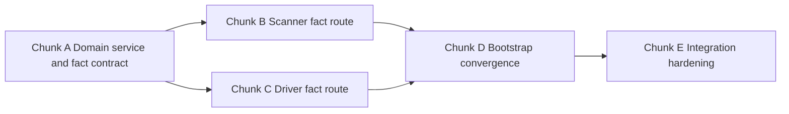

# Delivery-Plan Lock — Driver / Scanner / WorldMap Refactor

Source of truth for architecture and constraints: [plans/driver-scanner-worldmap-refactor-architecture-lock.md](plans/driver-scanner-worldmap-refactor-architecture-lock.md).

This delivery-plan lock is strictly implementation planning. It does **not** redesign architecture. All structure, authority, lifecycle, and boundary decisions are inherited from the approved architecture lock.

## 0. Locked scope and execution doctrine

- Implement only the approved refactor across driver, scanner, and domain world map ownership.
- Preserve explicit override boundaries already accepted in the architecture lock.
- Keep component naming unchanged during this delivery sequence.

---

## 1. Work breakdown into small controlled chunks

### Chunk A — Introduce domain ingestion surface and lifecycle owner

**Goal**
- Establish domain-owned world map lifecycle and metadata ingestion authority.

**Primary outcomes**
- Add domain-level fact contract object for driver/scanner publication.
- Add domain-level world map service to own lifecycle and mutation authority.
- Ensure map mutation is only through service-owned ingestion methods.

**Explicit file targets**
- New: `src/main/kotlin/ch/oliverlanz/memento/domain/worldmap/WorldMapService.kt`
- New: `src/main/kotlin/ch/oliverlanz/memento/domain/worldmap/ChunkMetadataFact.kt`
- Update: `src/main/kotlin/ch/oliverlanz/memento/domain/worldmap/WorldMementoMap.kt`
- Optional update if required by service boundaries: `src/main/kotlin/ch/oliverlanz/memento/domain/worldmap/ChunkSignals.kt`

**Depends on**
- None.

---

### Chunk B — Route scanner metadata writes through domain service

**Goal**
- Move scanner write-path to fact publication and domain ingestion surface.

**Primary outcomes**
- Scanner emits metadata facts during active run and passive enrichment.
- Scanner no longer owns authoritative map lifecycle.
- Scanner completion remains file-primary and passive mode remains active after completion.

**Explicit file targets**
- Update: `src/main/kotlin/ch/oliverlanz/memento/application/worldscan/WorldScanner.kt`
- Update: `src/main/kotlin/ch/oliverlanz/memento/application/worldscan/ChunkMetadataConsumer.kt`
- Update: `src/main/kotlin/ch/oliverlanz/memento/application/worldscan/ScanMetadataIngestion.kt`
- Update if contract plumbing requires: `src/main/kotlin/ch/oliverlanz/memento/application/worldscan/WorldScanEvents.kt`

**Depends on**
- Chunk A.

---

### Chunk C — Route driver propagation as metadata facts

**Goal**
- Replace driver downstream chunk-object propagation-to-map behavior with fact publication to domain ingestion.

**Primary outcomes**
- Driver emits facts only after full-load availability.
- Expiry without full load is never mapped as world map fact.
- Renewal hooks remain intact and are not semantically regressed.

**Explicit file targets**
- Update: `src/main/kotlin/ch/oliverlanz/memento/infrastructure/chunk/ChunkLoadDriver.kt`
- Update: `src/main/kotlin/ch/oliverlanz/memento/infrastructure/chunk/ChunkAvailabilityListener.kt`
- Update wiring boundary if needed: `src/main/kotlin/ch/oliverlanz/memento/domain/renewal/RenewalTrackerHooks.kt`

**Depends on**
- Chunk A.

---

### Chunk D — Bootstrap and lifecycle wiring convergence

**Goal**
- Converge scanner and driver publication streams into domain service during server lifecycle.

**Primary outcomes**
- Service instantiated once on server start and disposed on stop.
- Scanner and driver publication boundaries wired in bootstrap.
- Tick-thread ingestion path remains explicit.

**Explicit file targets**
- Update: `src/main/kotlin/ch/oliverlanz/memento/Memento.kt`
- Update if command/application attachment changes are required: `src/main/kotlin/ch/oliverlanz/memento/application/CommandHandlers.kt`

**Depends on**
- Chunks B and C.

---

### Chunk E — Integration hardening and observability verification pass

**Goal**
- Lock behavior under passive and active paths, duplicates, unresolved cases, and ingestion-thread boundaries.

**Primary outcomes**
- Verify idempotent ingestion behavior for duplicate facts.
- Verify scanner active-to-passive transition with continued passive enrichment.
- Verify driver ambient vs renewal provenance attribution on emitted facts.
- Verify no hidden scheduler/orchestrator introduced.

**Explicit file targets**
- Update as required by diagnostics or guards:
  - `src/main/kotlin/ch/oliverlanz/memento/domain/worldmap/WorldMapService.kt`
  - `src/main/kotlin/ch/oliverlanz/memento/infrastructure/chunk/ChunkLoadDriver.kt`
  - `src/main/kotlin/ch/oliverlanz/memento/application/worldscan/WorldScanner.kt`
  - `src/main/kotlin/ch/oliverlanz/memento/infrastructure/observability/MementoLog.kt`
  - `src/main/kotlin/ch/oliverlanz/memento/infrastructure/observability/MementoConcept.kt`

**Depends on**
- Chunk D.

---

## 2. Invariant verification checklist per chunk

### Chunk A checklist
- [ ] World map mutation authority is only domain service owned.
- [ ] Fact contract contains only boundary-safe data, never runtime chunk objects.
- [ ] World map remains authoritative memory with valid partial knowledge states.
- [ ] No hidden orchestration path introduced.

### Chunk B checklist
- [ ] Scanner remains file-primary for active run completion semantics.
- [ ] Scanner emits facts both during active run and passive enrichment.
- [ ] Scanner does not assume map lifecycle ownership.
- [ ] Off-thread file read details do not cross boundary as runtime types.

### Chunk C checklist
- [ ] Driver remains sole owner of engine chunk subscription authority.
- [ ] Driver emits metadata facts only after fully loaded chunk accessibility.
- [ ] Expiry without full load does not generate world map fact.
- [ ] Detection versus execution separation remains explicit.

### Chunk D checklist
- [ ] Service lifecycle is server start to server stop exactly once per server lifecycle.
- [ ] Scanner and driver both converge through explicit fact-ingestion boundary.
- [ ] Ingestion and map mutation happen on tick thread.
- [ ] Startup wiring does not add central orchestrator or hidden scheduler.

### Chunk E checklist
- [ ] Duplicate fact application is idempotent and explainable.
- [ ] Passive enrichment continues after active scan completion.
- [ ] Provenance attribution is visible for ambient vs renewal vs file-derived paths.
- [ ] Failure paths preserve partial knowledge and do not corrupt authoritative map.
- [ ] Architecture lock re-open conditions are unchanged unless explicitly approved.

---

## 3. Agreed test strategy with commands, signals, and run order

###+ Test sequence order

1. Compile and static integrity gate
2. Server boot wiring gate
3. Active scan lifecycle gate
4. Passive enrichment gate after active completion
5. Driver renewal-demand and ambient observation coexistence gate
6. Failure-path and idempotency gate
7. Shutdown lifecycle gate

### Commands

1. Build gate
   - `./gradlew build`

2. Runtime verification gate
   - `./gradlew runServer`

3. Runtime log inspection gate after run
   - Inspect `run/logs/debug.log`
   - Prioritize lines tagged with `(memento)` and component provenance markers.

### Expected verification signals

**Build gate signals**
- Build succeeds with no compile errors across domain/application/infrastructure seams.

**Boot gate signals**
- Service lifecycle attach signal appears once at server start.
- Driver attach and scanner attach signals appear once.
- No duplicate subscription-install warnings.

**Active scan gate signals**
- Active scan start and completion signals appear.
- Scanner emits fact publication signals during active run.
- Completion occurs without requiring full metadata for every chunk.

**Passive enrichment gate signals**
- After active completion, scanner remains passive and still accepts ambient enrichment.
- New ambient-derived facts are ingested without reopening active scan orchestration.

**Driver coexistence gate signals**
- Renewal-demand loads still feed renewal semantics.
- Ambient loads produce fact signals with distinct provenance.
- No chunk-object propagation across boundary to world map service.

**Failure and idempotency gate signals**
- Expired load without full load is logged as best-effort lifecycle outcome and not mapped as fact.
- Duplicate fact attempts do not create divergent map state.
- Unresolved metadata preserves partial knowledge without stopping ingestion pipeline.

**Shutdown gate signals**
- Service and subscriptions detach cleanly on server stop.
- No post-stop fact application attempts observed.

---

## 4. Failure and resilience model

### Policy matrix

| Scenario | Policy | Notes |
|---|---|---|
| Driver observed load never reaches full-load accessibility | Fail-soft for fact emission | Keep lifecycle observation, do not emit world map fact for expiry path |
| Scanner file metadata missing or unresolved | Degrade to unresolved/partial fact state | Preserve progress semantics, active scan completion remains valid |
| Fact publication transient ordering differences | Accept eventual convergence via idempotent ingestion | Domain map remains authoritative and monotonic in meaning |
| Duplicate fact publication from scanner or driver | Idempotent apply | No semantic duplication in world state |
| Domain ingestion precondition violation | Fail-fast with explicit signal | Protect map invariants, reject unsafe mutation |
| One stream fails scanner or driver | Partial-failure containment | Other stream continues; convergence resumes when failed stream recovers |

### Retry vs fail-fast

- **Retry path**
  - Safe retries are allowed only for boundary publication and ingestion steps proven idempotent.
  - Retry must never bypass full-load precondition for driver-origin facts.

- **Fail-fast path**
  - Any attempted map mutation outside service authority fails fast.
  - Any threading-boundary breach attempt fails fast and emits diagnostic signal.

### Idempotency requirements

- Fact application must be idempotent per chunk key plus provenance semantics.
- Replayed facts must not regress authoritative map state.
- Duplicate publication must remain observable but non-destructive.

### Partial-failure containment

- Scanner path failure does not block driver fact ingestion.
- Driver path failure does not block scanner ingestion.
- Renewal domain read surfaces remain available using latest authoritative map state.

### Degradation behavior

- Missing metadata is represented explicitly as unresolved or partial knowledge.
- System prefers conservative inaction over unsafe inferred completion.

### Replay and reconciliation

- Where events or facts are replayed, application remains deterministic and idempotent.
- Reconciliation is performed by reapplying valid facts through the same domain ingestion boundary.

---

## 5. Execution topology

### Critical path

1. Chunk A domain ingestion and service authority
2. Chunk B scanner write-path migration
3. Chunk C driver write-path migration
4. Chunk D bootstrap convergence
5. Chunk E integration hardening

### Parallel streams

- After Chunk A, scanner stream Chunk B and driver stream Chunk C can proceed in parallel.
- Chunk E starts only after both B and C converge through Chunk D wiring.

### Integration convergence points

- Convergence Point 1: domain fact contract consumed by both scanner and driver.
- Convergence Point 2: bootstrap wiring in [Memento.onInitialize()](src/main/kotlin/ch/oliverlanz/memento/Memento.kt:57) server lifecycle path.
- Convergence Point 3: tick-thread ingestion and runtime observability verification.

### Sequencing bottlenecks

- Domain service contract finalization blocks both scanner and driver migration.
- Bootstrap lifecycle wiring blocks meaningful runtime validation.
- Observability verification blocks lock-quality acceptance of failure/resilience guarantees.

### Delivery topology diagram

---

## 6. Code-mode handoff package per chunk

### Chunk A handoff

**Implementation directives**
- Create domain fact model and service lifecycle owner.
- Ensure service is sole mutation gateway to world map.

**File targets**
- `src/main/kotlin/ch/oliverlanz/memento/domain/worldmap/WorldMapService.kt`
- `src/main/kotlin/ch/oliverlanz/memento/domain/worldmap/ChunkMetadataFact.kt`
- `src/main/kotlin/ch/oliverlanz/memento/domain/worldmap/WorldMementoMap.kt`

**Acceptance criteria**
- Build passes.
- No non-domain mutation path to map remains.
- Fact type excludes runtime chunk object references.

### Chunk B handoff

**Implementation directives**
- Refactor scanner output to publish facts into service ingestion.
- Preserve active-complete-then-passive lifecycle semantics.

**File targets**
- `src/main/kotlin/ch/oliverlanz/memento/application/worldscan/WorldScanner.kt`
- `src/main/kotlin/ch/oliverlanz/memento/application/worldscan/ChunkMetadataConsumer.kt`
- `src/main/kotlin/ch/oliverlanz/memento/application/worldscan/ScanMetadataIngestion.kt`

**Acceptance criteria**
- Build passes.
- Scanner active run completes by file-primary semantics.
- Passive enrichment continues post-completion.

### Chunk C handoff

**Implementation directives**
- Refactor driver downstream propagation to fact publication only.
- Keep renewal load provider behavior and renewal hooks compatible.

**File targets**
- `src/main/kotlin/ch/oliverlanz/memento/infrastructure/chunk/ChunkLoadDriver.kt`
- `src/main/kotlin/ch/oliverlanz/memento/infrastructure/chunk/ChunkAvailabilityListener.kt`
- `src/main/kotlin/ch/oliverlanz/memento/domain/renewal/RenewalTrackerHooks.kt`

**Acceptance criteria**
- Build passes.
- Driver emits fact only after full-load accessibility.
- Expiry path does not create world map fact.

### Chunk D handoff

**Implementation directives**
- Wire service lifecycle in bootstrap and converge scanner and driver publication.
- Preserve server start/stop attach-detach integrity.

**File targets**
- `src/main/kotlin/ch/oliverlanz/memento/Memento.kt`
- `src/main/kotlin/ch/oliverlanz/memento/application/CommandHandlers.kt`

**Acceptance criteria**
- Build passes.
- Runtime boot and shutdown lifecycle signals are clean and singular.
- Tick-thread ingestion path is explicit and stable.

### Chunk E handoff

**Implementation directives**
- Harden duplicate handling, failure containment, and observability surfaces.
- Validate no hidden orchestration or thread-boundary drift.

**File targets**
- `src/main/kotlin/ch/oliverlanz/memento/domain/worldmap/WorldMapService.kt`
- `src/main/kotlin/ch/oliverlanz/memento/infrastructure/chunk/ChunkLoadDriver.kt`
- `src/main/kotlin/ch/oliverlanz/memento/application/worldscan/WorldScanner.kt`
- `src/main/kotlin/ch/oliverlanz/memento/infrastructure/observability/MementoLog.kt`
- `src/main/kotlin/ch/oliverlanz/memento/infrastructure/observability/MementoConcept.kt`

**Acceptance criteria**
- Build passes.
- Runtime signals confirm failure/resilience policy matrix behavior.
- Duplicate and replay behavior is idempotent and explainable.

## 7. Lock-quality completion criteria for Orchestrator-to-Code handoff

- Chunked plan is executable without architectural reinterpretation.
- Every chunk has file targets, dependencies, invariant checklist, and acceptance criteria.
- Test sequence, commands, and runtime verification signals are explicit.
- Failure/resilience expectations are bounded and testable.
- Critical path and convergence points are explicit.
